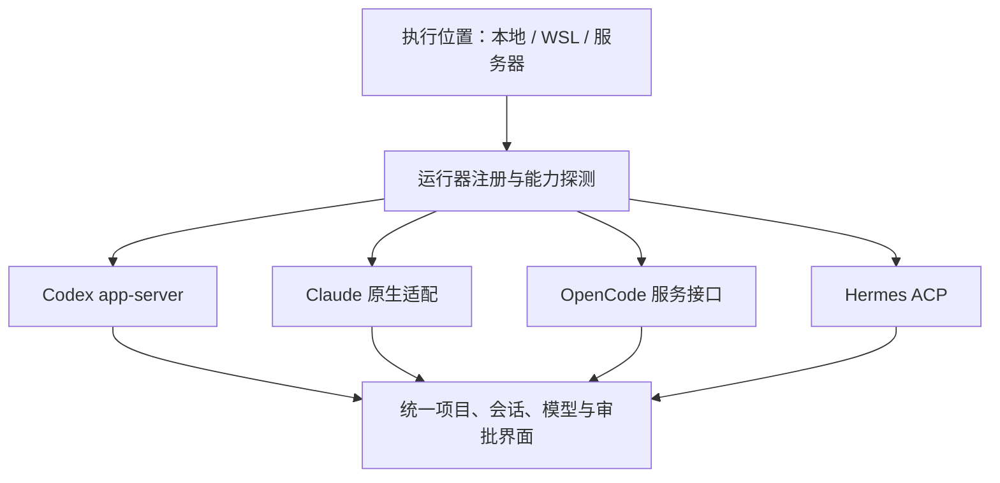

# PRD：本地工作台、原生会话与官方订阅

版本：0.1 · 2026-09-23 · 待评审方案，不是已实现清单。

输入：用户本轮五张截图及“先调研、出 PRD”要求。本 PRD 扩展原 [Windows 工作台 PRD](windows-workbench-prd.md)，不缩小原范围。事实及来源见 [调研报告](research/local-runtimes-2026-09-23.md)。配置视觉单列为 [模型映射 PRD](provider-editor-prd.md)。

## 1. 要交付的体验

打开 Yxi，左上角就能选择“本地”。用户看到此电脑的项目和已有 Agent 会话，能继续原来的 Codex 对话；首次新建默认“官方订阅”，不必重新填写 API Key。用户仍可为不同 Agent 指定第三方供应商。

本地不是一个额外的单轮命令表单，也不是伪造 SSH 服务器记录。位置、运行器、认证、会话是四个独立维度：

| 维度 | 示例 | 决定什么 |
| --- | --- | --- |
| 执行位置 | 本地 Windows、本地 WSL/Ubuntu、hk13 | 文件、进程、网络和数据根在哪里 |
| 运行器 | Codex、Claude Code、OpenCode、Hermes | 原生会话格式、工具和协议 |
| 认证/供应商 | 官方订阅、GLM配置、DeepSeek配置 | 有效端点、认证和模型能力 |
| 会话 | 原生 thread ID、Yxi关联 ID | 历史及后续对话归属 |

“本地”长期可见；首次安装且无上次选择时默认本地，升级用户保留上次服务器选择。旧“探索 → 本地 Agent”入口转到本地工作台，不维护另一套重复项目树。探索继续承载定时任务和连接等工具。

## 2. 导航与信息架构

左上位置选择器：

```text
本地 · 此电脑
所有主机
────────────
hk13 · 已连接
其他已保存服务器…
────────────
添加服务器… / 导入 / 导出
```

本地 Windows 为一级入口。已发现 WSL 时在本地位置中显示明确的发行版子选项；不能把 Linux 的 `/home/...` 与 Windows `C:\...` 自动当成同一目录。

主区域沿用统一工作区：项目树、对话、终端、文件和改动。每条 Agent 显示官方运行器图标；供应商、模型、权限在会话内说明，避免恢复独立“Codex 会话”栏目。

本地欢迎态包含：已发现运行器、最近项目、继续已有会话、新建任务。未安装项显示可操作的“安装/选择路径”，已有但不能启动显示原因，不能一律显示未安装。

“配置”页顶部也共享位置选择；不得出现左侧 hk13、实际却写本机配置而无提示的情况。本地插件全局共用，服务器插件只属于选中服务器，沿用已有用户决定。

## 3. 运行器发现（P0）

### 3.1 状态必须分层

每个候选记录：engine、运行环境、来源、可执行入口、版本、数据根、认证状态、支持能力、检查时间和失败原因。

安装状态：未发现 / 已发现待验证 / 可启动 / 版本不兼容 / 依赖缺失 / 权限不足 / 检测超时。认证状态另列：已登录官方 / API Key / 第三方 / 未登录 / 无法确认。目录存在不是安装成功，安装成功不是账号已登录。

### 3.2 发现顺序

1. 用户选择并已验证的固定入口。
2. 系统命令解析结果和已知官方安装位置，识别 `.exe`、npm `.cmd/.ps1`、Unix入口/符号链接、Hermes Python环境。
3. 已安装桌面产品暴露的 CLI 候选，标记“桌面附带”，只作兼容性探测；不得依赖不可公开承诺的缓存目录作为唯一入口。
4. 已知 WSL 发行版：默认先枚举，不因为启动 Yxi 就启动所有发行版；用户展开/刷新该环境时再限时探测。
5. 找不到时允许选择文件。不要全盘递归扫描，也不要运行来历不明的同名脚本。

探测只执行版本/能力/状态命令，不启动任务、不安装依赖、不触发自动升级。单候选建议3秒软超时、10秒上限；后台执行，可取消。外部安装变化可手动刷新，失败结果不可永久缓存。

多版本：按数据兼容性和来源展示可选项，不静默以 PATH 第一个覆盖当前会话绑定的版本。本机案例必须覆盖 npm 0.149.0 和桌面内置 0.155.0-alpha.16 共存。

Windows npm：优先解析可信安装清单并调用 Node/真正二进制；必须走包装器时固定命令，用户提示词走 stdin 或协议，不拼进 PowerShell/cmd 字符串。

### 3.3 安装引导

用户点击后显示官方来源、安装位置、依赖和是否需管理员；已有版本默认保留。安装完成重新探测版本、可启动性与协议能力，不以安装进程退出0作为唯一成功依据。代理、网络失败、企业策略、离线安装需求分别给原因；不偷偷替换既有认证。

## 4. 原生历史接入（P0）

### 4.1 列表与阅读

Codex 优先使用 app-server 的列表与只读历史接口，按实际版本 schema 协商。必须分页覆盖未归档、归档、不同 provider 和不同来源，允许搜索；不得默认只显示当前供应商的历史。

浏览列表不自动 resume，不生成新会话，不占用模型额度，不批量加载全文。全文按需分页；旧版无分页能力时应有大小上限和明确说明。列表所需字段：title、cwd、更新时间、来源、状态、原生ID、可恢复性。

本机已匹配截图中三个标题，是验收种子；正式测试使用独立副本或模拟原生数据，不能写用户真实历史。UI分组优先用可核对的原生项目元数据；只有 cwd 时按目录分组，用户可修改 Yxi 内的显示名称，不声称与原生桌面分组完全同步。

会话身份使用 `(hostId, OS-user, runtimeHome, engine, nativeSessionId)`，不能只用标题、项目名或原生 ID。

### 4.2 阅读、继续、接管分别处理

打开历史默认只读。继续时检查：运行器版本、工作目录、原生会话归属、账号/供应商、活动轮次、所需工具、附件可达性、权限设置。

原生桌面或 CLI 正在使用同一会话时：优先连接同一已支持的服务；无法取得可靠控制权时显示“原应用仍在运行／占用状态未知”，提供只读与基于原生 fork 的新分支。仅 Yxi 内互斥不能被描述为跨应用互斥。不得结束用户的原生进程来获取控制权。

接管可用的空闲原会话后才发送；同一原生会话在 Yxi 中只允许一个发送者。消息保留幂等/投递不明状态，异常断线不得自动重发。目录被移走时先定位恢复，不能静默切到用户主目录运行。

动态工具、浏览器或原生 App 专属插件不兼容时说明缺失项；不能显示“无缝恢复”却继续执行缺少关键工具的任务。旧附件、工具结果、压缩记录保留原语义。

### 4.3 跨运行器

沿用用户已选方案：换运行器时开启新的原生会话，并导入经过整理的旧对话摘要；原历史保留、双方相互链接。不得把 Claude JSONL 当 Codex rollout，也不得跨运行器直接复制长期记忆库。

摘要明确区分用户要求、完成事项、未完成事项、关键文件、假设及风险；用户可查看、编辑、排除附件或敏感片段。新 provider 接收旧上下文前，界面清楚显示执行位置和目标供应商。

## 5. 官方订阅默认与配置隔离（P0）

### 5.1 默认规则

新建 Codex 默认“官方订阅 · ChatGPT”；检测到原生已登录时显示原生返回的档位（如本机 Pro）及更新时间。未登录时默认卡仍被选中并展示“登录”，不得自动使用 API Key 或第三方端点。

Claude 对应使用其原生官方认证；OpenCode/Hermes 展示该运行器可用的登录/供应商，不把“官方订阅”当成所有厂商都通用的一种凭据。

继续已有会话优先保持其原配置，不因为产品新增默认项就改写老会话。用户选择切换时才应用；当前UI同时显示“登录账号”和“实际供应商”，二者可能不同。

### 5.2 原生认证流程

Yxi 调用受支持原生账号状态和登录接口，由原生工具处理回调、刷新和安全存储。Yxi 只保存引用和非秘密状态；不复制 `auth.json`、Keychain 令牌或全量环境到自己的配置文件，不代用户登录未知站点。

显示状态不要求主动刷新令牌；以最后核验时间区别缓存。额度从原生提供的窗口读取，未知显示“暂不可用”；不能用有 Pro 标签推断仍有额度。注销共享原生账号会影响其他客户端，操作前说明范围。

第三方 Key 和官方订阅凭据严格分开。`requires_openai_auth`、端点覆盖和环境变量必须由适配器验证；官方订阅模式只允许该官方认证链路，不把官方令牌送给任意 Base URL。

### 5.3 单 Agent 配置

有效配置目标：同一项目中 A=官方订阅、B=GLM第三方、C=DeepSeek第三方可以并行；一个 Agent 改配置不改另一个。

优先进程/会话级覆盖并验证运行器回执。不得为实现独立配置而覆盖共享 `~/.codex/config.toml`。不能简单换一个空的 `CODEX_HOME`：那会让原生账号、会话和记忆消失。数据根与进程配置隔离是两项不同设计。

“沿用外部配置”是独立高级选项，显示 CC Switch/原生文件的有效来源，不能伪装成官方订阅。用户主动选择全局同步时，才允许计划外的共享配置写入，必须展示影响范围、差异、备份和恢复。

## 6. 适配与数据边界



统一模型建议包含 `ExecutionHost`、`RuntimeInstallation`、`NativeAccountRef`、`ProviderProfileRef`、`SessionRef`、`SessionOwnership`、`CapabilitySet`；其中 capability 对读取、原地续聊、fork、附件、审批、取消、模型切换、记忆和定时执行分别记录 supported/unsupported/unknown 与版本。

本地数据：Yxi 的索引和关联放 `.yxi`；运行器的会话、凭据、记忆仍由其原生目录拥有。升级不迁移用户原生数据，路径变化允许重新绑定。将项目接到服务器不搬运本地账号；Windows/WSL 同名项目分别管理。

历史列表只用于展示，不把“source=cli/vscode”当作进程控制权。原生API不可用时只读文件适配可作为受版本限制的兜底，不直接写原生 SQLite 或 rollout。

## 7. 分阶段实现与交付门槛

| 阶段 | 范围 | 完成条件 |
| --- | --- | --- |
| L1 | 本地顶级入口、运行器发现、Codex 官方登录状态和历史浏览 | 本机截图会话可找到；无模型请求、无配置改写；npm/桌面双版本可辨认 |
| L2 | Codex 原生续聊、官方默认与每Agent线路、迁移原有本地任务入口 | 真实请求验证历史上下文、供应商隔离、重启恢复与并发控制 |
| L3 | Claude 原生历史和会话接入、权限卡片 | 本机 npm 与原生版本均通过；官方认证和API配置有可核对区别 |
| L4 | OpenCode Server/ACP、Hermes ACP | 安装、登录、模型选择、历史、审批、取消完整通过；未通过的按钮禁用并给原因 |
| L5 | 跨运行器摘要交接、定时任务统一与诊断导出 | 保留源历史；计划绑定明确宿主；丢回执不重发；诊断不含秘密 |

每阶段可单独发版，但日志必须准确注明已支持范围。禁止把缺界面、仅静态列表或仅单元测试算作整个阶段完成。

## 8. 验收矩阵

| ID | 场景 | 必须看到的证据 |
| --- | --- | --- |
| L-A01 | 开启Yxi，未配置服务器 | “本地”立即可选，可新建本地项目 |
| L-A02 | 只有 npm Claude/Codex；PATH 含空格、中文 | 正确发现并运行，提示词不被 shell 解释 |
| L-A03 | npm与桌面内置不同版本 | 展示两者及数据根，不静默降级 |
| L-A04 | 官方登录存在/失效/API配置覆盖 | 显示准确状态，官方默认不偷换成第三方；不输出令牌 |
| L-A05 | 原生历史来自多个provider/归档/无标题 | 分页数量、目标身份和内容一致；搜索不会漏掉旧provider |
| L-A06 | 从桌面已有会话继续 | 实际模型请求含旧上下文，原生ID正确，原应用仍能读取新增历史 |
| L-A07 | 原桌面正在运行同会话 | 没有并行写入；占用未知不得假报空闲 |
| L-A08 | 官方A、第三方B/C在同目录并行 | 通过测试端点观察各自请求、Key及模型；全局配置哈希不变 |
| L-A09 | 同一数据根中的本地记忆开/关 | 开时按原生规则可用，关时不注入；不合并ChatGPT网页记忆 |
| L-A10 | 原目录或附件丢失、插件工具缺失 | 具体缺失提示；不在错误目录继续执行 |
| L-A11 | app-server重启、版本升级、登录更新 | 只重连原宿主/会话；未确认消息不重发 |
| L-A12 | WSL与Windows及hk13同名项目 | 文件路径、凭据和会话不串台 |
| L-A13 | OpenCode/Hermes审批、取消、断连 | 界面响应映射原生语义；不默认自动批准 |
| L-A14 | 切运行器 | 新原生会话带可审阅摘要，源历史未更改 |

性能目标是验收目标而非现状：本地入口不等待探测；热启动列表首屏2秒内，慢扫描显示渐进结果；正文按需读取，不一次载入全部历史。

## 9. 需共同确认的产品边界与推荐值

当前按用户已明确要求确定：本地顶级入口、默认官方订阅、支持现有Codex历史、跨运行器新对话加摘要。

以下默认建议用于后续评审：

1. 原生历史首次读取使用本机已安装运行器，尊重原生账号和记忆开关；不批量搬家。
2. 原应用占用不明时先只读/分支；不强行接管。
3. “官方订阅”失败停在原因和登录入口，不自动产生第三方费用。
4. OpenCode/Hermes 作为完整运行器适配分阶段交付，不只添图标。
5. 本地调度依赖Yxi运行；若希望关客户端也执行，要另立宿主服务方案，不能在此入口中默默安装常驻服务。

仍需验证才能定案：桌面会话共享控制接口、桌面专有工具可移植性、各版本认证/模型能力、用户实际需要的WSL默认发行版。未解决项记录为验收阻塞，不能用“读到了会话文件”替代。
